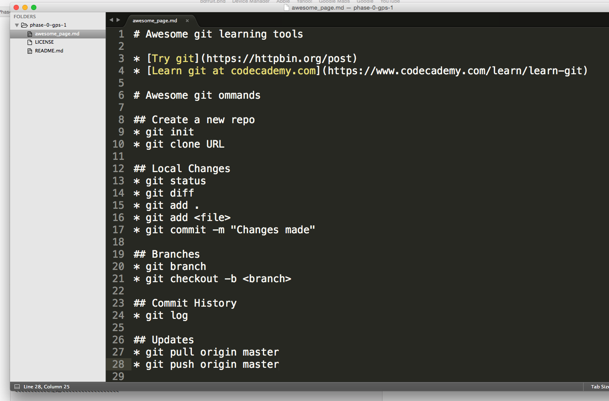

# Awesome git learning tools

	learning git is very important for a web developer, so here are the tools and git commands that are very helpful.

* [Try git](https://httpbin.org/post)
* [Learn git at codecademy.com](https://www.codecademy.com/learn/learn-git)

**Awesome screenshot**:

# *Awesome git ommands*

## Create a new repo
* git init
* git clone URL

## Local Changes
* git status
* git diff
* git add .
* git add <file>
* git commit -m "Changes made"

## Branches
* git branch
* git checkout -b <branch>

## Commit History
* git log

## Updates
* git pull origin master
* git push origin master

## merge
* git merge <branch>
